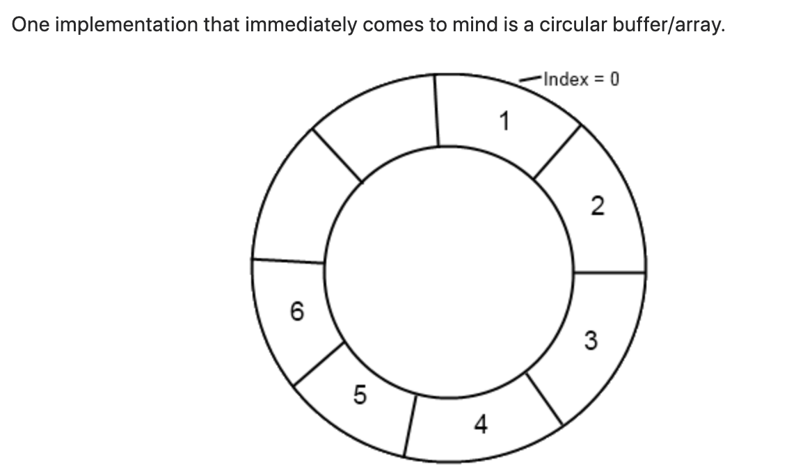

### ex00

std::map::lower_bound uses binary search to find the first element in the sorted map that is not less than the specified key. The function returns an iterator to this element, which can be used to access the element's value.

If the key is found in the map, std::map::lower_bound will return an iterator to the element with the specified key. If the key is not found in the map, std::map::lower_bound will return an iterator to the first element that is not less than the specified key.

Note that std::map::lower_bound returns an iterator to an element in the map, not a reference or pointer to the element's value. To access the value of the element, you can use the ->second or (*it).


std::map is a sorted associative container, which means that its elements are always sorted in ascending order by their keys. Therefore, std::map::lower_bound uses binary search to find the first element in the sorted map with a key that is not less than the specified key.

When you insert elements into a std::map, they are automatically sorted by their keys using a comparison function (by default, std::less). This ensures that the order of the elements is always maintained, and allows for efficient searching and retrieval of elements using operations such as std::map::lower_bound.

So, to clarify, std::map::lower_bound uses binary search to find the first element in the sorted map that is not less than the specified key,


### ex01 RPN


```c
#include<stdio.h>

int main()
{
        int a = 4;
        int b = 5;

        int c = a+b;
}
```
assembly friendly

mov move add 

4 5 +

```
(gdb) disass main
=> 0x0000561dcb9ad129 <+4>:	movl   $0x4,-0x4(%rbp)
   0x0000561dcb9ad130 <+11>:	movl   $0x5,-0x8(%rbp)
   0x0000561dcb9ad137 <+18>:	mov    -0x4(%rbp),%edx
   0x0000561dcb9ad13a <+21>:	mov    -0x8(%rbp),%eax
   0x0000561dcb9ad13d <+24>:	add    %edx,%eax
```


### ex02 MergeInsertSort

Insertion sort is efficient for small arrays, while merge sort is efficient for larger arrays. 

 u can think of deque as a circular buffer/array
 
 
 
 https://www.quora.com/What-is-a-possible-implementation-for-std-deque

A deque stores its elements in multiple chunks of contiguous memory, usually in a structure that consists of a series of fixed-size arrays. Each array, called a "block," contains a certain number of elements, and the blocks are linked together to form the deque. When elements are added or removed from the front or back of the deque, the blocks may need to be rearranged to maintain the contiguous storage and efficient access times. This is different from a vector, which stores its elements in a single contiguous block of memory.

 

The fact that the elements are stored in multiple chunks of contiguous memory allows for better memory allocation and usage. Additionally, because the elements are not stored in a single contiguous block, the deque can grow dynamically without having to move all the existing elements to a new memory location.

 The deque container is essentially a dynamically allocated array of pointers, where each pointer points to a fixed-size array (block) that holds the elements.[array of pointers to n-byte arrays] This allows for efficient insertion and deletion of elements at both the front and back of the deque, since only the pointers to the affected blocks need to be updated, and not the entire contents of the container.

 

suppose we have a block of size four with three elements
what will happened if we add the fourth element
and what will happened when we will add a new 5th element

1- Suppose we have a deque with a block of size four and it already contains three elements. When we add the fourth element, the following steps will happen:

* The deque will check if there is enough space in the current block to add the new element.
* Since there is space in the current block, the new element will be added to the end of the block.
* The deque will update its internal variables to reflect the new size and position of the elements.
* No new block will be created since there is still space left in the current block.

2-  Now suppose we have a deque with a block of size four and it already contains four elements. When we add the fifth element, the following steps will happen:

* The deque will check if there is enough space in the current block to add the new element.
* Since there is no space in the current block, the deque will need to create a new block to hold the new element.
* A new block will be created, and the fifth element will be added to the new block.
* The deque will update its internal variables to reflect the new size and position of the elements, including the new block.
* The new block will be linked to the previous block(s) to form a contiguous storage.
 
 To look up an element in the block, the deque implementation typically needs to traverse the blocks to find the block containing the desired element. Once it has located the correct block, it can directly access the element using its index within the block.

For example, let's say we want to access the 7th element of a deque that contains 100 elements. The deque implementation would first need to calculate which block the 7th element is in (e.g., if each block contains 10 elements, the 7th element would be in the first block). It would then traverse the blocks to find the first block, and finally access the 7th element within that block.

Because of this process, accessing an element in a deque may take slightly longer than accessing an element in a vector, which uses a single contiguous block of memory. However, deque's ability to efficiently add and remove elements from both the front and back of the container makes it a useful alternative in many cases.


 ==
```
 vector is the type of sequence that should be used by default, 
 list should be used when there are frequent insertions and deletions from the middle of the sequence, 
 deque is the data structure of choice when most insertions and deletions 
 take place at the beginning or at the end of the sequence.

 Effective STL - by Scott Meyers 2
```

```
Contiguous-memory containers [also known as array-based containers] store their elements 
in one or more (dynamically allocated) chunks of memory,
each chunk holding more than one container element. 
If a new element is inserted or an existing element is erased,
other elements in the same memory chunk have to be shifted up or down to make room for the new element 
or to fill the space formerly occupied by the erased element. This kind of movement affects 
both performance (see Items 5 and 14) and exception safety (as we'll soon see). 
The standard contiguous-memory containers are vector, string, and deque. 
The nonstandard rope is also a contiguous-memory container.

Node-based containers store only a single element per chunk of (dynamically allocated) memory. 
Insertion or erasure of a container element affects only pointers to nodes, 
not the contents of the nodes themselves,
so element values need not be moved when something is inserted or erased.

 Effective STL - by Scott Meyers 2
```

### repeated single-element insertions VS single range insertion

```


when you try to insert an element into a vector whose memory is full,
the vector allocates new memory with more capacity, 
copies its elements from the old memory to the new memory, destroys the elements in the old memory,
and deallocates the old memory. 
Then it adds the element that is being inserted. 

most vector implementations double their capacity each time they run out of memory,
so inserting 1000 elements one at a time can result 
in 10 new allocations (including their incumbent copying of elements).
In contrast (and. by now, predictably), a range insertion can figure out how much new memory
it needs before it starts inserting things (assuming it is given forward iterators), 
so it need not reallocate a vector's underlying memory more than once. 

range insertions into associative containers may indeed be more efficient than repeated single-element insertions

 Effective STL - by Scott Meyers 16
```

The difference in timing between processing a range of  elements with std::vector and std::deque is likely due to the way these two containers store their elements in memory.

std::vector stores its elements in contiguous memory, which means that accessing elements in a std::vector is generally faster than accessing elements in a std::deque, especially for large ranges of elements. This is because accessing elements in contiguous memory involves fewer memory lookups and cache misses.

On the other hand, std::deque stores its elements in chunks of memory called "blocks", and each block is allocated separately. This means that accessing elements in a std::deque requires more memory lookups and cache misses than accessing elements in a std::vector, which can lead to slower processing times for small ranges of elements.

==

The difference in timing between processing a range of  elements with std::vector and std::deque may be due to a combination of factors, including:

Memory allocation: std::vector stores its elements in contiguous memory, which can make it faster than std::deque for accessing elements that are close together. In contrast, std::deque stores its elements in a more complex data structure that can require more memory allocations and deallocations, which can slow down performance.

Cache locality: Because std::vector stores its elements in contiguous memory, it can take advantage of CPU cache locality to access elements more quickly. In contrast, std::deque stores its elements in a more complex data structure that may not be as cache-friendly, which can slow down performance.

In general, std::vector is typically faster than std::deque for accessing elements, especially when the number of elements is large. This is because std::vector stores its elements in contiguous memory, which allows for faster access times and better cache locality.

==

### memory allocation and cache locality.
**

Arrays have better cache locality that can make a pretty big difference in performance.

arrays are contiguous memory blocks, so large chunks of them will be loaded into the cache upon first access. This makes it comparatively quick to access future elements of the array. Linked lists on the other hand aren't necessarily in contiguous blocks of memory, and could lead to more cache misses, which increases the time it takes to access them.


contiguous memory blocks = cache friendly

Principle of Locality
https://youtu.be/3XmALGPW0zA

the library example
https://youtu.be/247cXLkYt2M

C++ cache locality and branch predictability
https://www.youtube.com/watch?v=EmzdmqUWq3o

14:30 data locality, nearby data is likely to be accessed soon
https://youtu.be/LzsiFYVMqi8

===

A deque (double-ended queue) allows for efficient insertion and removal of elements at both ends of the container. In general, accessing elements at the beginning or end of a deque has constant time complexity, i.e., O(1).

However, accessing or modifying elements in the middle of a deque is not as efficient as in a vector or an array, as it requires shifting all elements after the target element to maintain the deque's structure. This operation has a time complexity of O(n), where n is the number of elements in the deque.

So, to summarize, a deque has constant time complexity for inserting or removing elements at the beginning or end of the container, but not for accessing or modifying elements in the middle of the deque.


```

compile with -g

// (gdb) p &veq_sequence
// $3 = (std::vector<long, std::allocator<long> > *) 0x7ffd4d040370


(gdb) p &veq_sequence[0]
$11 = (long *) 0x556ecd4cd140
(gdb) x/d 0x556ecd4cd140
0x556ecd4cd140:	1
(gdb) p veq_sequence[1]
$14 = 2

(gdb) x/30wx &veq_sequence[0]
0x556ecd4cd140:	0x00000001	0x00000000	0x00000002	0x00000000
0x556ecd4cd150:	0x00000003	0x00000000	0x00000004	0x00000000
0x556ecd4cd160:	0x00000005	0x00000000	0x00000006	0x00000000
```


The main difference between a deque and a vector is in their performance characteristics for certain operations.

##### Access:

* Both deque and vector provide constant-time access to elements at the beginning or end of the container.
* Vector provides faster access to elements in the middle of the container due to its contiguous memory layout.
* Accessing elements in the middle of a deque has a time complexity of O(n) since it requires iterating over the elements between the beginning or end of the deque and the target element.

##### Inserting or Removing:

* Both deque and vector allow for efficient insertion and removal at the end of the container.
* Inserting or removing elements in the middle of a vector can be expensive since it requires shifting all subsequent elements to maintain the vector's structure. The time complexity of this operation is O(n).
* Inserting or removing elements in the middle of a deque is more efficient than in a vector since it only requires updating pointers to the neighboring elements. However, it is still less efficient than inserting or removing elements at the beginning or end of the container.
